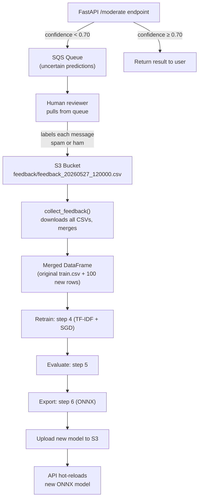
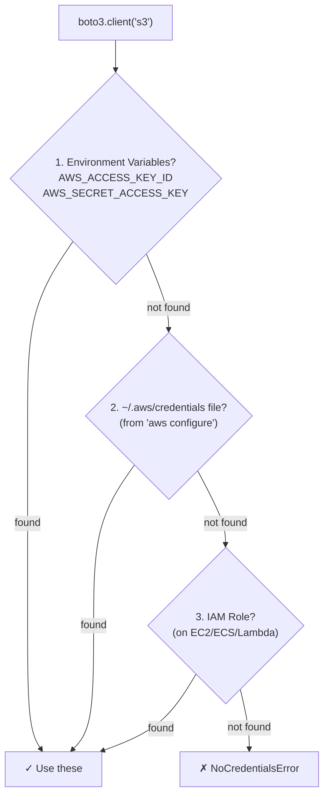

# Feedback Loop, AWS, UI & MLflow — Explained

## 1. How Do 100 Human Answers Get Fed Back Into the System?

### The Short Answer

Yes, they become **CSV files** on S3. But the model does **NOT** re-run all 11 steps — it only reruns the **training → evaluate → export** steps (4-6) with the new data merged in.

### The Full Flow



### What Happens Step-by-Step

**1. Uncertain predictions get queued:**  
When someone sends text to `/moderate` and the model's confidence is below 0.70, it gets pushed to SQS:

```python
# In step11_aws.py → AWSPipeline.flag_uncertain()
if confidence < threshold:  # threshold = 0.70
    self.sqs.send_for_review(text, predicted_label, confidence)
```

**2. Human reviewer pulls messages and labels them:**

```python
# Pull 10 messages from queue
messages = pipeline.sqs.poll_reviews()

# For each message, human provides the correct label
pipeline.submit_review(
    receipt_handle=msg["receipt_handle"],
    text=msg["body"]["text"],
    true_label=1,  # human says "yes, this is spam"
    predicted_label=msg["body"]["predicted_label"],
    confidence=msg["body"]["confidence"],
)
```

**3. Each review gets saved as a CSV row in S3:**

The CSV looks like this:
```
text,true_label,predicted_label,confidence,reviewed_at
"Free entry call now!!!",1,0,0.52,2026-05-27T12:00:00+00:00
"Hey are you coming?",0,1,0.61,2026-05-27T12:01:00+00:00
```

The key columns are:
| Column | Meaning |
|--------|---------|
| `text` | The original message |
| `true_label` | What the **human** said (ground truth) |
| `predicted_label` | What the **model** said (potentially wrong) |
| `confidence` | How confident the model was |
| `reviewed_at` | When the human reviewed it |

**4. Once you hit ~100 reviews, you trigger a retrain:**

```python
# Collect all feedback CSVs from S3
feedback_records = pipeline.collect_feedback()
# Returns a list of 100 dicts

# Merge into original training data
df_original = pd.read_csv("data/processed/train.csv")
df_feedback = pd.DataFrame(feedback_records)
df_combined = pd.concat([df_original, df_feedback])

# Retrain (steps 4-6 only, NOT steps 1-3)
train(df_combined)
evaluate()
export_onnx()

# Upload new model
pipeline.sync_model("upload")
```

> [!IMPORTANT]
> You do **NOT** re-run steps 1-3 (download, EDA, clean). Those are one-time data preparation steps. You only retrain the model (step 4), evaluate it (step 5), re-export to ONNX (step 6), and upload the new model.

### What's Currently Missing (Needs to Be Built)

The code currently has all the **pieces** but not the **glue script** that automates the retrain trigger. Right now you'd do it manually. A production system would have a cron job or Lambda function that:

1. Checks if `feedback_count >= 100`
2. Downloads all feedback CSVs
3. Merges with training data
4. Retrains → evaluates → exports
5. Uploads new model to S3

---

## 2. How Does the AWS Part Work? Does It Take My Credentials?

### The Short Answer

Yes, it uses your **locally configured** AWS credentials. It does **NOT** ask for them inside the code — it uses the standard `boto3` credential chain.

### How `boto3` Finds Your Credentials

When you call `boto3.client("s3")`, the AWS SDK looks for credentials in this order:



### How to Set Up (You Haven't Done This Yet)

**Option A — `aws configure` (recommended for local dev):**
```powershell
# Install AWS CLI first if you don't have it
winget install Amazon.AWSCLI

# Then configure
aws configure
# It will ask:
#   AWS Access Key ID:     AKIA...........
#   AWS Secret Access Key: wJalr..........
#   Default region:        us-east-1
#   Output format:         json
```

This creates `~/.aws/credentials` and `~/.aws/config` files on your machine.

**Option B — Environment variables:**
```powershell
$env:AWS_ACCESS_KEY_ID = "AKIA..."
$env:AWS_SECRET_ACCESS_KEY = "wJalr..."
$env:AWS_DEFAULT_REGION = "us-east-1"
```

### What the Code Actually Does with AWS

| Resource | What It Does | Created By |
|----------|-------------|-----------|
| **S3 Bucket** (`spam-classifier-artifacts`) | Stores model files (`.onnx`, `.pkl`) and feedback CSVs | `python step11_aws.py --setup` |
| **SQS Queue** (`spam-review-queue`) | Message queue for uncertain predictions waiting for human review | `python step11_aws.py --setup` |

### Important: No Credentials Are Hardcoded

Looking at [step11_aws.py](file:///c:/Users/deepm/OneDrive/Documents/projectmoderator/spamwork/step11_aws.py):

```python
# Line 99 — boto3 automatically uses your configured credentials
self.s3 = boto3.client("s3", region_name=region)

# Line 271
self.sqs = boto3.client("sqs", region_name=region)
```

If credentials aren't found, the script catches the error cleanly:
```python
except NoCredentialsError:
    print("✗ AWS credentials not found!")
    print("  Configure them with: aws configure")
```

> [!TIP]
> **If you don't have an AWS account**, you can skip step 11 entirely. Steps 1-10 work fully without AWS. For your viva, you can explain the architecture without actually running it against real AWS resources.

---

## 3. Is There a UI in Our Project?

### Current State: No Dedicated UI

Right now, the project has **no frontend dashboard**. You have:

| What Exists | How to Access |
|-------------|--------------|
| FastAPI Swagger UI | `http://localhost:8000/docs` (auto-generated API documentation where you can test endpoints) |
| MLflow Dashboard | `http://localhost:5000` (built-in MLflow UI for experiment tracking) |
| Plots | Static PNGs in `spamwork/plots/` (EDA charts, confusion matrix, AL curves) |

### What's Missing (And Would Be Impressive for a Viva)

A monitoring dashboard that shows:
- 📊 Real-time classification stats (how many spam/ham today)
- 🔄 Human feedback progress (37/100 reviews done, progress bar)
- 📈 Model performance over retrain cycles
- ⏳ SQS queue depth (how many items waiting for review)
- 🏥 API health status

> [!NOTE]
> **Want me to build this?** I can create a single-page HTML dashboard that talks to your FastAPI backend and shows all of this. It would be a great visual for your viva presentation. Just say the word.

---

## 4. How Do I Open the MLflow Dashboard?

### Step-by-Step

**1. Make sure MLflow is installed:**
```powershell
pip install mlflow
```

**2. Run step 9 at least once to generate tracking data:**
```powershell
cd c:\Users\deepm\OneDrive\Documents\projectmoderator\spamwork
python step9_mlflow.py
```

This creates the `mlruns/` directory inside `spamwork/` with all the experiment data.

**3. Launch the MLflow UI:**
```powershell
cd c:\Users\deepm\OneDrive\Documents\projectmoderator\spamwork
mlflow ui --port 5000
```

**4. Open your browser:**
```
http://localhost:5000
```

### What You'll See

The MLflow dashboard shows:

| Tab | What's There |
|-----|-------------|
| **Experiments** | List of runs (each `python step9_mlflow.py` creates one) |
| **Parameters** | All hyperparameters (`tfidf_max_features=10000`, `sgd_alpha=0.0001`, etc.) |
| **Metrics** | `test_f1`, `test_accuracy`, `val_roc_auc`, `train_time_s`, etc. |
| **Artifacts** | The actual model files (`.pkl`, `.onnx`) stored per run |

### Pro Tip: Run the Sweep for a Better Demo

```powershell
python step9_mlflow.py --sweep
```

This runs **3 different configurations** (baseline, high-regularization, large-vocab) and logs them all. In the MLflow UI you can then **compare runs side-by-side** — this looks very impressive in a viva.

### Where Does MLflow Store Data?

From [step9_mlflow.py line 67](file:///c:/Users/deepm/OneDrive/Documents/projectmoderator/spamwork/step9_mlflow.py#L67):
```python
mlflow.set_tracking_uri(f"file:///{config.WORK_DIR / 'mlruns'}")
```

All data is stored locally in:
```
spamwork/mlruns/
├── .trash/
├── 0/                  ← default experiment
├── <experiment-id>/    ← your sms-spam-classifier experiment
│   └── <run-id>/
│       ├── params/
│       ├── metrics/
│       ├── artifacts/
│       └── meta.yaml
```

> [!WARNING]
> You **must** run `mlflow ui` from the `spamwork/` directory (or wherever `mlruns/` lives), otherwise it won't find the data. Alternatively, set the tracking URI: `mlflow ui --backend-store-uri file:///c:/Users/deepm/OneDrive/Documents/projectmoderator/spamwork/mlruns --port 5000`

---

## Quick Reference: Running Everything

```powershell
# Terminal 1: Start the API
cd c:\Users\deepm\OneDrive\Documents\projectmoderator\spamwork
python step8_api.py
# → http://localhost:8000/docs

# Terminal 2: Start MLflow dashboard
cd c:\Users\deepm\OneDrive\Documents\projectmoderator\spamwork
mlflow ui --port 5000
# → http://localhost:5000

# Terminal 3: Run experiments
cd c:\Users\deepm\OneDrive\Documents\projectmoderator\spamwork
python step9_mlflow.py --sweep      # generates tracking data
python step10_active_learning.py    # generates AL plots
```
